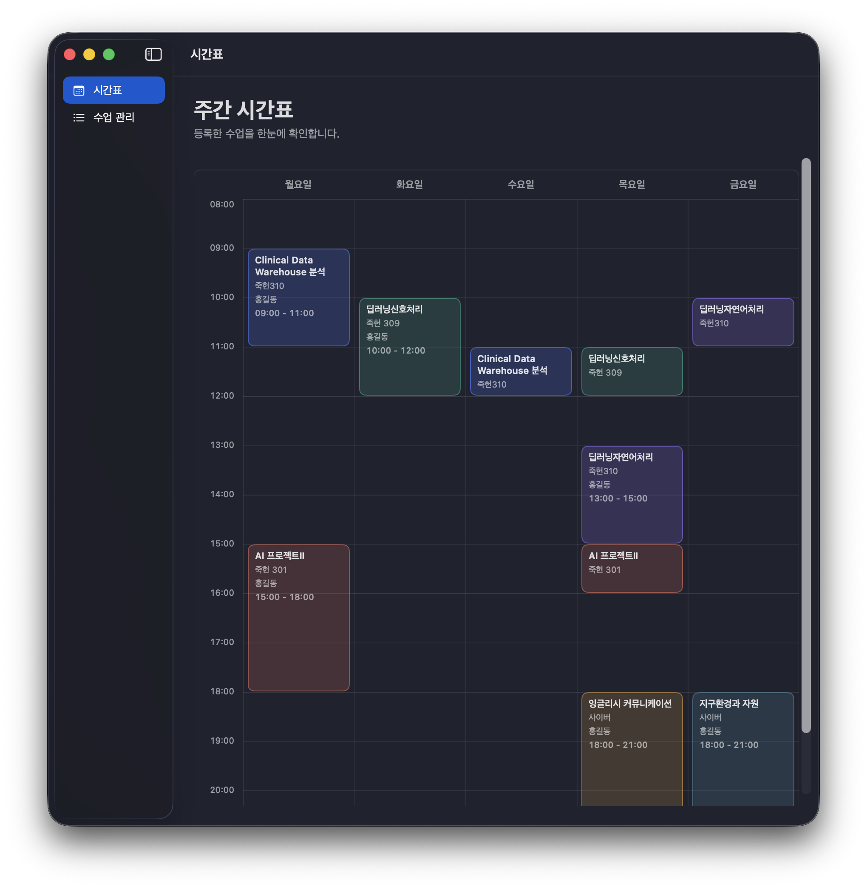
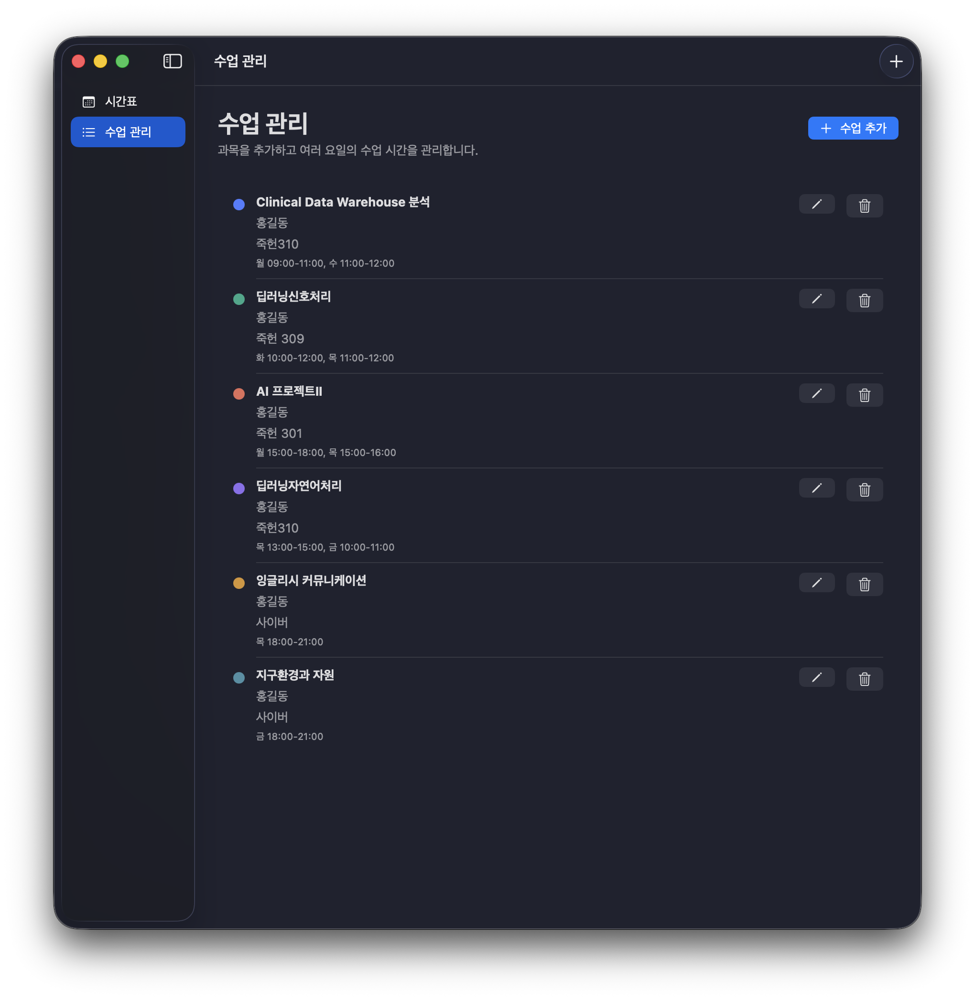
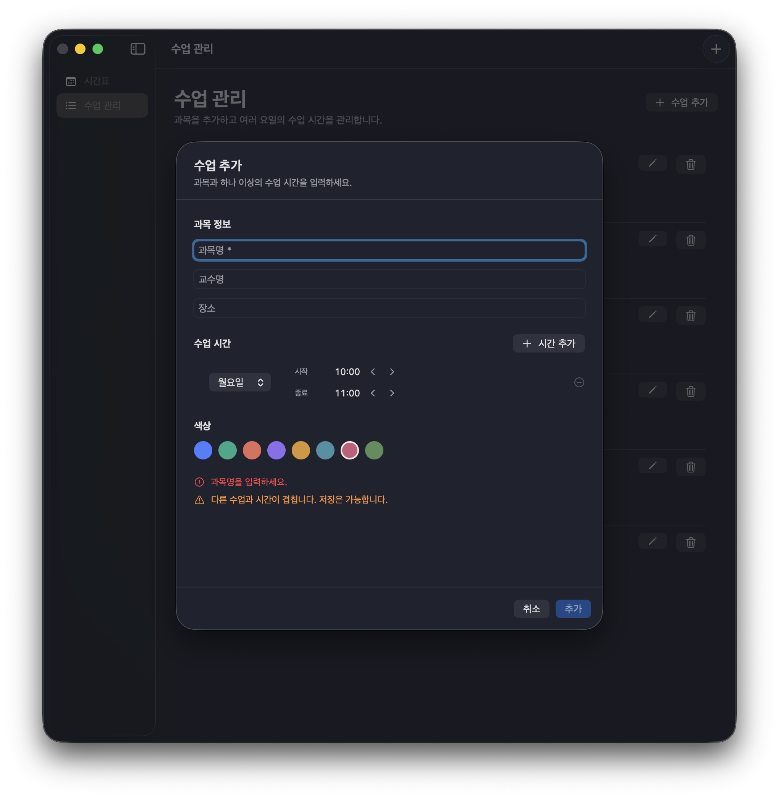
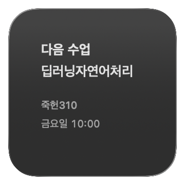
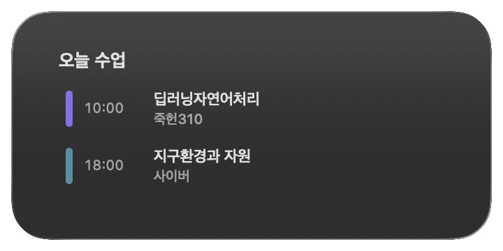
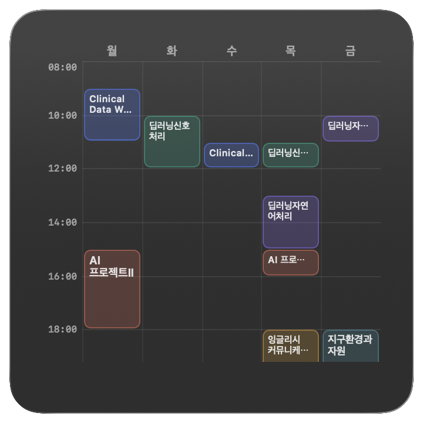

# Classboard for macOS
macOS 위젯에서 강의 시간표를 확인하고 관리해보세요.

  

 

불필요한 요소를 최소화하고, macOS 기본 기능처럼 자연스럽고 직관적인 사용자 경험을 제공하도록 디자인했습니다.
설정 앱에서 강의 시간표를 직접 수정한뒤, Small / Medium / Large 3가지 크기의 위젯으로 확인해보세요.

👉 **Latest Version**
https://github.com/ehdghl12/Classboard-for-macOS/releases/latest/download/Classboard.dmg

## 설정 앱

  

내 수업 일정에 맞춰 구성된 주간 시간표를 한눈에 확인할 수 있습니다.
각 강의는 시간대에 맞춰 블록 형태로 표시되어 수업 시간과 요일을 직관적으로 파악할 수 있습니다.
- 월요일부터 금요일까지 주간 일정 표시
- 08:00 ~ 22:00 시간대 제공
- 강의 시간을 기준으로 한 블록형 시간표 UI
- 여러 수업의 일정과 시간 배치를 한눈에 확인

  
  

내 수업 일정에 맞춰 강의를 자유롭게 추가하고 편집할 수 있습니다.
과목 정보부터 교수명, 강의 장소, 수업 시간, 강의별 색상까지 간편하게 설정할 수 있습니다.
- 과목명 · 교수명 · 강의 장소 설정
- 강의별 요일 및 수업 시간 지정
- 1시간 단위로 간편하게 시간 조절
- 강의별 색상 지정으로 직관적인 시간표 구성

## 위젯
Classboard는 필요한 정보의 양에 따라 세 가지 크기의 위젯을 제공합니다.
설정 앱에서 시간표 구성이 완료되면 앱을 열지 않아도 Mac 바탕화면에서 바로 수업 일정을 확인할 수 있습니다.
### Small 다음 수업 — 현재 시점에서 가장 가까운 다음 수업을 간단하게 확인

  
  

### Medium 오늘 수업 — 오늘 예정된 수업 일정을 한눈에 확인

  
  

### Large 주간 시간표 — 월요일부터 금요일까지 전체 수업을 시간표 형태로 확인

  
  

## Reference
 Mac에서 위젯 추가 및 사용자화하기
https://support.apple.com/ko-kr/guide/mac-help/mchl52be5da5/mac

## License
MIT © 2026 ehdghl12
